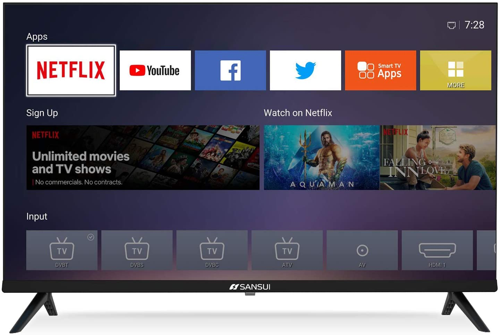
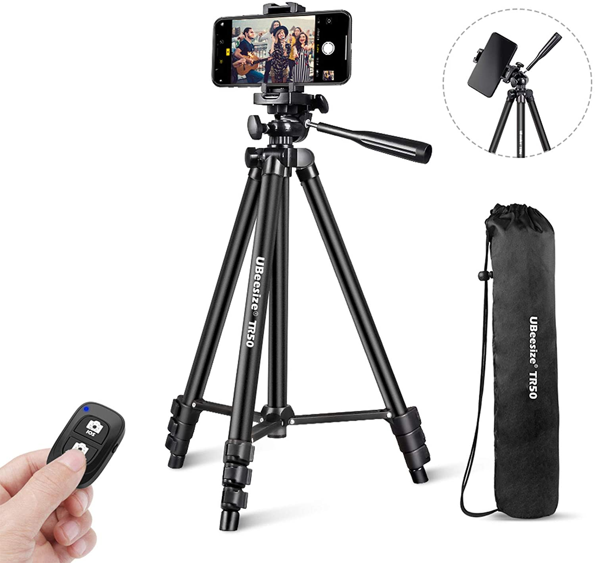

<html>
<head>
<title>Productos electrónicos</title> 
</head>
<body>
	

<h1>Productos electrónicos</h1>

   
   
1. COWIN E7.

   

   
  </head>
  <body>
    <h1>Datos del Cliente:</h1>
     Nombre : <input type="text" id="nombre_cliente" placeholder="Ingrese nombre del cliente">  
         Id:  <input type="text" id="id_cliente" placeholder="Ingrese id del cliente.">  
         Telefono:  <input type="text" id="telefonoc" placeholder="Ingrese telefono del cliente.">  
         Id:  <input type="text" id="direccionc" placeholder="Ingrese direccion del cliente.">  
           <input onclick="factura()" type="submit" value="Enviar">
  </body>

</body>
</html>
